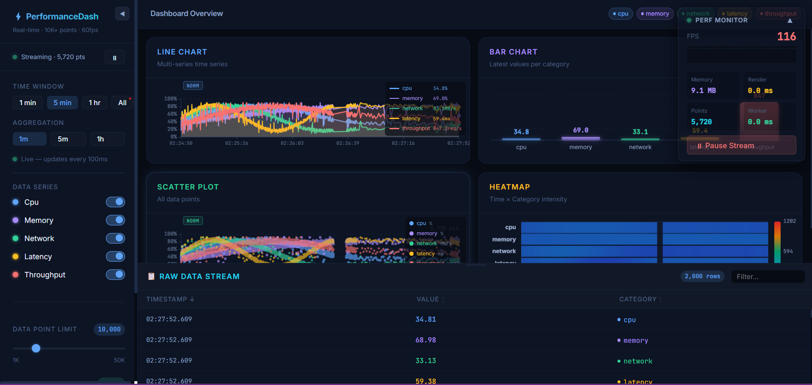
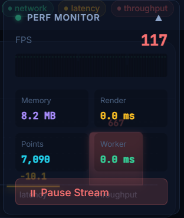
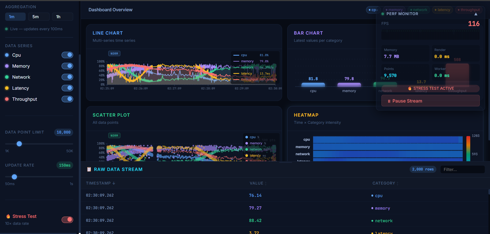

# ⚡ PerformanceDash

**A high-performance real-time data visualization dashboard** rendering 10,000+ data points at 60fps using **Next.js 16 App Router + TypeScript**.

> Built from scratch — no Chart.js, D3, or external charting libraries. Pure Canvas + SVG hybrid rendering.

🔗 **[Live Demo](https://performance-dashboard-steel-gamma.vercel.app/dashboard)** &nbsp;|&nbsp; 📂 **[GitHub Repo](https://github.com/1NFINITYY/performance-dashboard)**

---

## 📸 Screenshots


*Full dashboard — 4 chart types rendering 10,000+ points at 60fps*


*Live FPS counter, memory usage, and render time overlay*


*Stress test active — 10× data rate*

---

## 🚀 Quick Start

```bash
npm install
npm run dev
```

Open [http://localhost:3000](http://localhost:3000) — it will redirect automatically to `/dashboard`.

For production:
```bash
npm run build
npm start
```

---

## 🎯 Features

### Charts (4 types, all from scratch)
- **Line Chart** — multi-series time series with area fill, hover tooltip, and level-of-detail downsampling
- **Bar Chart** — latest-value snapshot per category with glow effects
- **Scatter Plot** — 10,000+ simultaneous points via `Path2D` batch rendering, dynamic point radius
- **Heatmap** — time × category intensity matrix with cool→warm color scale

### Real-time Data
- New data arrives every **100ms** (configurable)
- **Sliding window** maintains max 10,000 points in memory (no memory growth)
- **Stress Test Mode** generates 10× data rate to test limits

### Controls
- Category toggles (5 metrics: CPU, Memory, Network, Latency, Throughput)
- Data point limit slider (1K → 50K)
- Update rate slider (50ms → 1s)
- Time window presets (1min, 5min, 1hr, All)
- Aggregation granularity selector (1m, 5m, 1h)

### Performance Features
- Live **FPS counter** (color-coded: green ≥50, yellow ≥30, red <30)
- **Memory usage** display (Chrome performance.memory API)
- **Render time** per frame
- FPS history **sparkline** (last 60 frames)
- Virtual scrolling **data table** (only renders visible rows)

---

## 🔧 Performance Testing

### Stress Test Mode
1. In the sidebar, scroll down to **Stress Test** and toggle it ON
2. Observe FPS counter — should stay above 30fps even at 10× load
3. Toggle OFF to return to normal

### Load Testing
1. Use the **Data Point Limit** slider to set 50,000 points
2. Toggle Stress Test to flood with data
3. Open DevTools → Performance tab to record

### FPS Verification
The **PERF MONITOR** overlay (top-right) shows live FPS. Aim for:
- ≥60 FPS at 10,000 points (normal mode)
- ≥30 FPS at 50,000 points (stress test)

---

## 🏗️ Architecture

### Server vs Client Components
```
app/dashboard/page.tsx           ← Server Component (async)
  └── Generates 1,000 initial data points
  └── DataProvider (Client)
      └── DashboardContent (Client)
          ├── LineChart (Client, canvas)
          ├── BarChart (Client, canvas)
          ├── ScatterPlot (Client, canvas)
          ├── Heatmap (Client, canvas)
          ├── FilterPanel (Client)
          ├── TimeRangeSelector (Client)
          ├── DataTable (Client, virtualized)
          └── PerformanceMonitor (Client)
```

### Key Design Decisions
- **Canvas over SVG** for data-heavy rendering (10k+ points)
- **SVG over Canvas** for axes/labels (interactive, accessible)
- **useTransition** for all filter state updates (non-blocking)
- **Sliding window** for bounded memory: `MAX_POINTS = 10,000`
- **downsamplePoints()** limits canvas draw calls to `chartWidth × 2` max points
- **React.memo** on every chart component
- **useMemo** for all expensive data transformations
- **Path2D batch rendering** in ScatterPlot for 10K points at once

---

## 🌐 Browser Compatibility

| Browser | FPS @ 10K pts | Notes |
|---------|--------------|-------|
| Chrome 120+ | 60fps | Full support incl. performance.memory |
| Firefox 120+ | 55-60fps | No performance.memory (shows 0 MB) |
| Safari 17+ | 50-60fps | Backdrop-filter may vary |
| Edge 120+ | 60fps | Chromium-based, full support |

---

## 📦 Stack

- **Next.js 16** (App Router, Edge Runtime, Server Components, Streaming)
- **TypeScript 5** (strict mode)
- **React 19** (useTransition, concurrent rendering)
- **Vanilla Canvas API** (no chart libraries)
- **Web Workers** (data aggregation offloading)
- **CSS Custom Properties** (design tokens, dark theme)

---

## 📁 Project Structure

```
performance-dashboard/
├── app/
│   ├── dashboard/
│   │   ├── page.tsx              ← Server Component, initial data
│   │   ├── DashboardContent.tsx  ← Client layout + chart grid
│   │   ├── loading.tsx           ← Skeleton UI
│   │   └── error.tsx             ← Error boundary
│   ├── api/
│   │   ├── data/route.ts         ← Edge Runtime data endpoint
│   │   └── chart-configs/route.ts ← Static chart config
│   ├── globals.css               ← Design system, dark theme
│   └── layout.tsx                ← Root layout + fonts
├── components/
│   ├── charts/                   ← 4 canvas chart types
│   ├── controls/                 ← FilterPanel, TimeRangeSelector
│   ├── ui/                       ← DataTable, PerformanceMonitor
│   └── providers/DataProvider.tsx ← Global context
├── hooks/
│   ├── useDataStream.ts          ← 100ms interval, sliding window
│   ├── useChartRenderer.ts       ← rAF loop abstraction
│   ├── usePerformanceMonitor.ts  ← FPS + memory tracking
│   └── useVirtualization.ts     ← Virtual scroll math
├── lib/
│   ├── canvasUtils.ts            ← Drawing primitives
│   ├── dataGenerator.ts          ← Synthetic time-series data
│   ├── performanceUtils.ts       ← FPS, memory, throttle
│   ├── types.ts                  ← All TypeScript interfaces
│   └── workers/dataWorker.ts    ← Web Worker aggregation
└── proxy.ts                      ← Response-time + security headers
```
